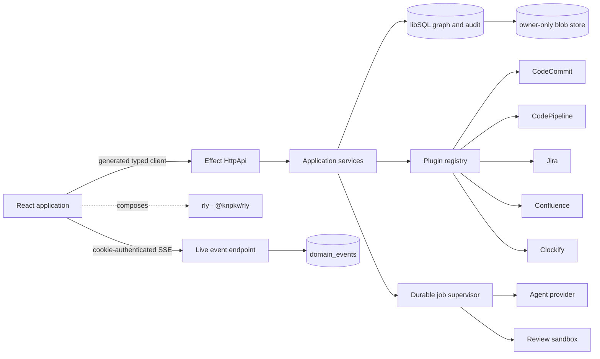
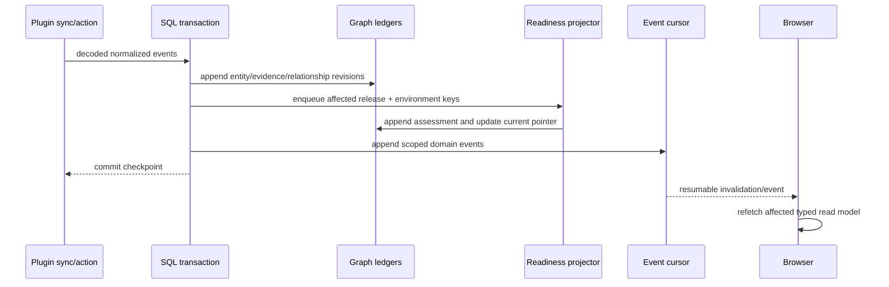
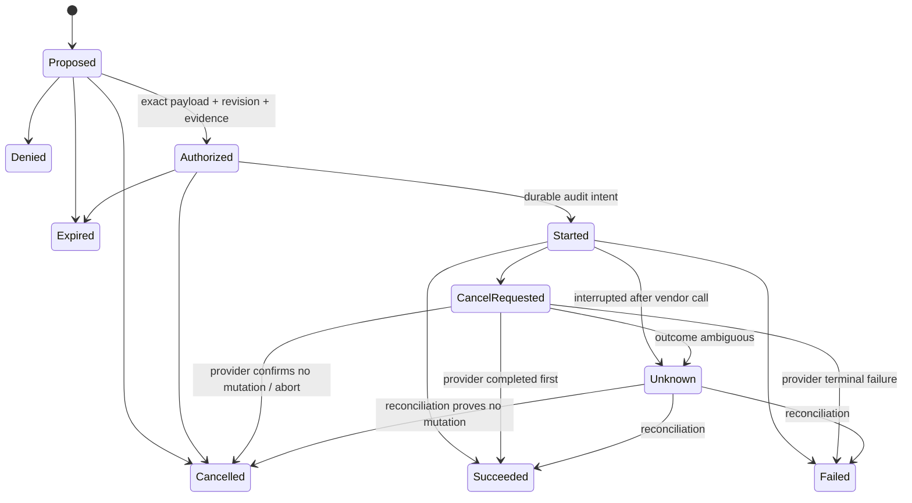

# Control Center — Production Design

## Status

Status: **Phase 3 approved; additive cdx/cld provider design incorporated during Phase 4 planning**

This document turns the approved instructions and Phase 2 requirements into an implementation architecture. It is deliberately a production redesign, not a port of the prototype. The prototype remains a visual acceptance fixture until the corresponding production routes pass.

## 1. Decisions at a glance

| Concern              | Decision                                                                                                                                                                             | Why                                                                                                                               |
| -------------------- | ------------------------------------------------------------------------------------------------------------------------------------------------------------------------------------ | --------------------------------------------------------------------------------------------------------------------------------- |
| Product architecture | `@knpkv/control-center` application plus independent browser-only **rly** package, `@knpkv/rly`                                                                                      | One deployable local application, a reusable/testable UI contract, and no credentials, vendors, or server services in rly's graph |
| Runtime              | Node 24, React 19, Vite, Effect Platform Node, Effect HttpApi, Effect Atom React                                                                                                     | Matches the workspace and keeps HTTP contracts, runtime services, and client state typed                                          |
| Persistence          | Control Center-owned libSQL database plus an owner-only content-addressed blob directory                                                                                             | Transactional graph/audit data without putting large diffs, logs, or artifacts into normal rows                                   |
| Topology             | One same-origin process serves the SPA, `/api/v1`, and authenticated SSE                                                                                                             | Avoids CORS and makes pairing, cookies, CSRF, and LAN behavior understandable                                                     |
| Authentication       | First-run pairing code, opaque hashed sessions, HttpOnly cookies, exact Origin/Host policy, CSRF on mutations                                                                        | Suitable for a local single-workspace application without pretending LAN exposure is trusted                                      |
| Plugins              | Versioned, vendor-neutral first-party adapters, dynamically scoped by connection with `LayerMap.Service`                                                                             | A failed or disabled service cannot take down the application or another adapter                                                  |
| Delivery truth       | Immutable evidence and relationship ledgers with derived, versioned readiness assessments                                                                                            | Readiness answers “why” and remains auditable instead of being a copied status string                                             |
| Live updates         | Durable event cursor in libSQL; bounded PubSub is only a wake-up hint                                                                                                                | Resume and restart produce authoritative state without duplicate or lost terminal events                                          |
| Remote actions       | Durable propose → authorize → execute → reconcile state machine                                                                                                                      | Exact target, evidence, permission, vendor call, and outcome stay attributable and idempotent                                     |
| Agent                | Replaceable Effect AI providers: separate local **cdx** and **cld** CLI packages, OpenAI-compatible HTTP, durable release threads/jobs, read/propose-only tools, hardened PR sandbox | Local or remote execution remains contextual, typed, cancellable, and unable to bypass human governance                           |
| PR diff              | Design-system-owned pinned `@pierre/diffs` wrapper, React `CodeView`, complete application inventory, lazy contents, stable finding anchors                                          | Centralizes renderer behavior while the application retains data fetching and immutable diff identity                             |
| Visual system        | “Release Relay”: one oversized decision, restrained surfaces, named people, deterministic SVG release identity                                                                       | Reimagined Linear with Apple calm and IFTTT causality, without dashboard noise                                                    |
| Documentation/tests  | Storybook component catalog, Vitest, Effect contract/integration tests, Playwright with one worker                                                                                   | Design system is built and verified before pages; browser resource use stays bounded                                              |

### Explicit non-goals

- No third-party executable plugin loading in v1. The contract is versioned, but the shipped registry contains audited first-party adapters only.
- No hosted multi-tenant control plane, native mobile app, or browser-held vendor credentials.
- No autonomous vendor mutation, ungoverned agent tool, or sandbox network access.
- No generic graph-canvas home page. Relationships are presented around the release decision with an equivalent semantic list/table.
- No production imports from the prototype, its mock collections, or its CSS cascade.

## 2. Product and information architecture

### 2.1 Primary question

The product is for a release owner answering:

> **What can ship, why, who owns the next decision, and where has it actually deployed?**

Every page therefore has one dominant statement, one primary action, explicit people, current freshness, and a visible path back to the release. Counts and service data support that decision; they are not decorative dashboard tiles.

### 2.2 Canonical routes

```text
/pair
/shares/:shareId
/w/:workspaceId/overview
/w/:workspaceId/releases/:releaseId/preview
/w/:workspaceId/releases/:releaseId
/w/:workspaceId/active-work/:workstreamId
/w/:workspaceId/items
/w/:workspaceId/timeline
/w/:workspaceId/settings
/w/:workspaceId/jira/issues/:issueId
/w/:workspaceId/codecommit/pull-requests/:pullRequestId
/w/:workspaceId/codepipeline/executions/:executionId
/w/:workspaceId/confluence/pages/:pageId
/w/:workspaceId/clockify/entries/:entryId
```

Release rows always open the preview route. The preview is rendered as a modal route on desktop and a full-screen sheet on compact screens. Only **Open full view** navigates to the full release route. Browser history carries the exact origin in router state; direct loads fall back to the entity's semantic parent route, never a demo/default entity.

### 2.3 Shell

- Wide: a single 248 px application sidebar and a 64 px contextual top bar.
- Standard: the sidebar contracts to a 72 px labeled icon rail; contextual lists open in a sheet.
- Compact: a 56 px top bar and bottom navigation for Overview, Active work, Items, Agent, and More.
- The sidebar owns primary navigation, release shortcuts, plugin-health summary, theme, and profile.
- The top bar owns breadcrumbs, command/search, freshness, and the exact-context agent entry.
- There is no second top-level tab bar and no floating agent button covering content.

### 2.4 Release page hierarchy

```text
Release Relay + version + codename     Freshness    Owner / approver
ONE LARGE VERDICT
One-sentence reason                    [state-specific 56 px action]
────────────────────────────────────────────────────────────────────
Build ───────── Verify ───────── Production       environment-aware

JIRA WORK · all items in one card                  PIPELINE DIMENSION
Issue 1  ─┬─ PR A · review state                   execution / stages
Issue 2  ─┤                                         artifacts / logs
Issue 3  ─┼─ PR B · review state                   deploy approvals
Issue 4  ─┤
Issue 5  ─┘
Issue 6  · missing PR relationship

Runbook / evidence / gaps                          People and roles
Durable release agent thread                       Audit and activity
```

The six-item fixture is exact for acceptance, not a domain limit. At zero, one, six, or twenty items the same card remains comprehensible: Jira is the work dimension, PR groups are the code dimension, and pipeline executions are the delivery dimension. Many-to-many links are explicit; no card infers grouping from matching labels.

The compact preview retains this same mental model in less space: verdict/reasons, freshness, Relay, named roles, Build/Verify/Production, the complete Jira work card, PR grouping, pipeline activity, Confluence evidence, gaps, state-specific action, and a condensed release-thread entry. Full view expands evidence history, environments, relationships, audit, and the durable inline thread; it does not rearrange the dimensions the user just learned.

### 2.5 Full entity pages

All five services use `EntityShell`: service mark, one large title/verdict, status and freshness, named collaborators/roles, relationship chain plus table, native content, evidence/activity, contextual release agent, and governed actions. The native center differs intentionally:

- Jira issue: key/status/priority/estimate/release fields, readable description with explicit edit/cancel/save, acceptance-criterion checklist, comments and replies, validated composer, full change history, delivery evidence, and conflicts against the source revision.
- CodeCommit PR: immutable base/head and revision, author/reviewers/approvers, review lifecycle, complete file tree and diff workbench, comments/findings, sandbox review progress, request changes, approval/revoke, and governed merge.
- Confluence page: readable sanitized content, version/history, attachment/runbook evidence, contributors, watchers/approvers, linked work/delivery state, and revision-bound edit proposal.
- CodePipeline execution: pipeline and execution identity, stage rail, action attempts, bounded logs, artifacts, target environments, operators/deployment approvers, failure evidence, and governed start/stop/approval/retry.
- Clockify detail: entries and rollups, contributor and approver names, duration/date/project facts, Jira/release association evidence, missing links, and governed correction/approval.

Each section has loading, empty, stale, partial, unavailable, error, and not-found states without hiding the last valid cache. Every linked object opens its full canonical route and preserves the originating release/entity context.

## 3. Package and module architecture

### 3.1 Package tree

```text
packages/
├── rly/
│   ├── package.json
│   ├── tsconfig.json
│   ├── vite.config.ts
│   ├── vitest.config.ts
│   ├── .storybook/
│   ├── component-manifest.ts
│   ├── lint/{no-raw-colors,no-app-imports,enforce-variant-metadata}.ts
│   ├── scripts/{generate-tokens,generate-registry,scaffold-component}.ts
│   ├── src/
│   │   ├── index.ts
│   │   ├── tokens/{color,type,space,shape,motion}.ts
│   │   ├── foundations/{ThemeProvider,GlobalStyles,Icon,LinkProvider,PortalProvider}.tsx
│   │   ├── primitives/{Text,Surface,Button,Dialog,Sheet,Avatar,...}.tsx
│   │   ├── patterns/{ReleaseRelay,Verdict,PeopleStrip,StageRail,...}.tsx
│   │   ├── diff/{DiffWorkbench,DiffFileTree,DiffFinding,worker}.tsx
│   │   ├── types/{people,release,evidence,agent,diff}.ts
│   │   └── styles/{reset,tokens,base}.css
│   ├── registry/{components.json,schema.json,USAGE.md}
│   ├── stories/
│   ├── test/{unit,component,a11y,exports,consumer,fixtures}/
│   └── visual/
├── cdx/
│   ├── package.json
│   ├── src/{CodexConfig,CodexError,CodexLanguageModel,CodexProcess,index}.ts
│   └── test/{contract,fixtures,consumer}/
├── cld/
│   ├── package.json
│   ├── src/{ClaudeConfig,ClaudeError,ClaudeLanguageModel,ClaudeProcess,index}.ts
│   └── test/{contract,fixtures,consumer}/
└── control-center/
    ├── package.json
    ├── tsconfig.json
    ├── tsconfig.client.json
    ├── tsconfig.server.json
    ├── vite.config.ts
    ├── vitest.config.ts
    ├── playwright.config.ts
    ├── public/
    ├── src/
    │   ├── index.ts
    │   ├── domain/{ids,actor,entity,release,release-identity,relationship,evidence,...}.ts
    │   ├── api/{ControlCenterApi,Authorization,groups,schemas}/
    │   ├── client/
    │   │   ├── main.tsx
    │   │   ├── app/{router,providers,route-state}.tsx
    │   │   ├── api/{client,live-events}.ts
    │   │   ├── presenters/{release,entity,people,diff}.ts
    │   │   └── features/{portfolio,release,active-work,items,timeline,settings,jira,codecommit,codepipeline,confluence,clockify,agent}/
    │   └── server/
    │       ├── main.ts
    │       ├── config/
    │       ├── http/{handlers,middleware,static}.ts
    │       ├── auth/
    │       ├── persistence/{Database,Migrations,repositories,object-store}/
    │       ├── application/{Portfolio,DeliveryGraph,Readiness,Governance}.ts
    │       ├── plugins/{contract,registry,sync,adapters}/
    │       └── agents/{contract,context,jobs,providers,sandbox}/
    ├── test/{unit,contract,integration,page,fixtures}/
    └── e2e/
```

**rly**, published as `@knpkv/rly`, exports only `.`, `./tokens`, `./foundations`, `./primitives`, `./patterns`, `./diff`, `./diff/bounded`, `./diff/workbench`, `./styles.css`, `./registry/components.json`, `./registry/schema.json`, `./registry/search.json`, and `./registry/USAGE.md`. It owns presentation-only readonly prop types, interaction callbacks, renderer adapters, styles, icons, and release-identity rendering. It performs no routing, fetching, persistence, permission checks, or domain derivation and has no dependency on `@knpkv/control-center`, Effect server packages, workspace vendor clients, or vendor response types. React and React DOM are peers; Geist and `@pierre/diffs` are direct implementation dependencies.

`@knpkv/control-center` exports only `.`, `./api`, `./domain`, and `./server`, and its client depends on the design system through `workspace:^`. Client presenters convert decoded application read models into design-system props; callbacks invoke typed application commands. Server/domain tsconfigs and import-boundary tests forbid design-system imports, so the dependency exists only in client composition. This keeps readiness, authorization, freshness, relationships, and release-identity derivation in the application. Client and API projects cannot import `server/**`. SQL, filesystem, secrets, process control, vendor clients, and agent providers remain server-only. Browser persistence is limited to theme and diff-layout preferences; domain state stays authoritative on the server.

Control Center domain owns `relay/v1`: hashing canonical release identity, selecting the codename and exactly three distinct bounded symbol indices, persisting the projection/version, migrations, and golden vectors. The design-system `ReleaseRelay` accepts only the already-derived codename, algorithm label, and three symbol indices and maps those indices to code-owned SVG paths. It never sees the canonical release ID and cannot derive or mutate identity. Control Center and rly are independently versioned, receive changesets, and treat breaking exported domain/prop/token/rendering contracts as semantic-version changes.

The package family follows short, lowercase, consonant-forward identifiers: **rly**, **cdx**, and **cld** now, with `ccmt`, `jr`, and `cnflnc` reserved as future-facing names for CodeCommit, Jira, and Confluence surfaces or packages. V1 adapter contracts retain explicit provider IDs so a future package rename does not migrate persisted evidence. Visible navigation and `ServiceMark` accessibility names continue to say “CodeCommit,” “Jira,” “Confluence,” “Codex,” and “Claude”; compact identifiers may appear in paths, commands, and developer-facing APIs but never become the only user-facing label.

**cdx**, published as `@knpkv/cdx`, and **cld**, published as `@knpkv/cld`, are independent server-side packages adapting the installed local Codex and Claude CLIs to Effect AI's `LanguageModel.LanguageModel`. Each exports documented `make`, `layer`, configuration, discovery/capability, and tagged-error APIs; uses `LanguageModel.make` for `generateText`, structured generation, and `streamText`; and owns its CLI-specific Schema decoders and scoped process translation. Neither imports Control Center, rly, vendor integrations, or the other wrapper. CLI executables and credentials are detected external prerequisites rather than package contents. Control Center depends on both through `workspace:^` only in its server provider registry.

All four new packages are independently versioned and receive changesets. cdx/cld treat their Effect AI layer, configuration, error, capability, and supported CLI-protocol contracts as semantic-versioned public API.

### 3.2 rly build and export contract

`component-manifest.ts` is the checked-in source of truth for public entries, category, component/pattern status, CSS needs, variant metadata, and registry visibility. Build/scaffold scripts derive the barrel exports, Vite library entries, package export fragments, and agent registry from it, then fail if generated output differs from the working tree. This avoids maintaining the same component list manually in three places.

- ESM-only output with per-entry JavaScript and declarations; React and React DOM are peers.
- rly wraps the workspace-aligned `radix-ui` primitives for focus, dismissal, roving focus, and overlay semantics; it does not re-export Radix or expose Radix-specific types in public props. The implementation and icon library are direct dependencies behind rly APIs.
- Only React component/diff entry chunks receive `"use client"`; pure tokens, types, and generated metadata remain server/import-tool safe.
- `sideEffects` names CSS only. Importing tokens/types cannot initialize globals.
- `@pierre/diffs` is reachable only through `./diff`; normal primitives do not pull its renderer/worker chunks.
- Stable public entrypoints are tested after build: every declared JS, declaration, CSS, and source map exists; no undeclared deep import resolves. CI never skips these checks when `dist` is absent—it builds first and treats absence as failure.
- A packed-tarball consumer fixture imports every code/CSS entry under strict TypeScript, renders representative components, and resolves, reads, and schema-validates every published registry artifact, catching differences hidden by workspace aliases. The package `files` allowlist includes the registry artifacts, and post-pack inspection fails if any are absent.
- Boundary tests reject `@knpkv/control-center`, vendor, Node, Effect server, router, fetch, and persistence imports anywhere in rly.
- `LinkProvider` accepts standard anchor props and lets Control Center bridge React Router. `PortalProvider` supplies the overlay root so previews, dialogs, tooltips, and diff popovers share focus/inert/stacking behavior without assuming `document.body`.

The component scaffolder creates the component, focused stylesheet, public index, Storybook stories, DOM/a11y test, and manifest entry in one operation. It never generates an empty component without states/tests, and CI verifies the manifest, filesystem, build entries, exports, registry, and stories remain one-to-one.

### 3.3 Runtime composition



The generated HttpApi client handles snapshots and mutations. `@effect/atom-react` owns request state, cache invalidation, and optimistic UI only where the command is locally reversible. SSE invalidates or advances typed read models by cursor; it does not become a second source of truth. The design system is below the application in the dependency graph and receives already-authorized presentation models and callbacks; it never imports or calls the API.

## 4. Domain and persistence design

### 4.1 Aggregate boundaries

- `Workspace`: policy, retention, settings, connection membership, revision.
- `PluginConnection`: secret reference, capabilities, health, checkpoint, freshness, and sync lease.
- `Entity`: canonical/vendor identity and immutable normalized revisions; vendor-specific projections preserve native detail.
- `Release`: identity, target environments, roles, stage summary, and current assessment reference. It references graph records rather than owning vendor entities.
- `RelationshipLedger`: immutable revisions with lifecycle and supersession.
- `EvidenceLedger`: append-only, content- or revision-addressed claims.
- `ReadinessAssessment`: immutable result for release, environment, rule version, and exact evidence set.
- `Decision`: human or agent review/approval against an immutable target revision.
- `GovernedAction`: proposal, authorization, attempts, and outcome.
- `AgentThread`: exactly one per `(workspaceId, releaseId)` with immutable ordered messages.
- `Job`: durable sync, action, agent, and sandbox lifecycle with lease and attempts.
- `Session`: actor, workspace, permission scope, expiry, and revocation.

Every repository call requires `WorkspaceId`; composite foreign keys make cross-workspace joins structurally invalid. Display names and Jira keys are never internal primary keys.

### 4.2 Initial schema groups

| Group              | Tables                                                                                                                                                                                                                                                          |
| ------------------ | --------------------------------------------------------------------------------------------------------------------------------------------------------------------------------------------------------------------------------------------------------------- |
| Foundation         | `workspaces`, `workspace_settings`, `persons`, `person_identities`, `role_assignments`                                                                                                                                                                          |
| Authentication     | `sessions`, `pairing_codes` — hashes only                                                                                                                                                                                                                       |
| Plugins            | `plugin_connections`, `plugin_capabilities`, `plugin_health`, `plugin_sync_state`, `plugin_sync_runs`                                                                                                                                                           |
| Graph              | `entities`, `entity_revisions`, `releases`, `release_targets`, `relationship_heads`, `relationship_revisions`, `evidence`, `evidence_claims`, `readiness_assessments`, `release_readiness_current`                                                              |
| Native projections | `jira_issues`, `jira_criteria`, `jira_comments`, `jira_history`, `codecommit_prs`, `pr_commits`, `pr_files`, `confluence_pages`, `confluence_revisions`, `pipeline_executions`, `pipeline_stages`, `pipeline_artifacts`, `clockify_entries`, `clockify_rollups` |
| Collaboration      | `decisions`, `agent_threads`, `agent_messages`, `agent_findings`                                                                                                                                                                                                |
| Durable work       | `jobs`, `job_attempts`, `job_events`, `sandboxes`, `sandbox_logs`                                                                                                                                                                                               |
| Governance         | `governed_actions`, `action_authorizations`, `action_attempts`, `audit_events`                                                                                                                                                                                  |
| Delivery           | `domain_events` with monotonic integer cursor, `projection_offsets`                                                                                                                                                                                             |
| Integrity          | `quarantined_records`, `cleanup_runs`, `backup_manifests`                                                                                                                                                                                                       |
| Large content      | `content_blobs` metadata; bytes live in the content-addressed object directory                                                                                                                                                                                  |

Mutable heads carry an integer revision and update through compare-and-swap. Canonical vendor identity, release thread identity, action idempotency key, and external event ID have unique constraints. A command updates aggregate state, appends audit/domain events, and enqueues affected readiness keys in one `sql.withTransaction`.

### 4.3 Readiness flow



Only affected release/environment keys are recomputed. Previous assessments remain immutable. A missing or failed plugin makes freshness and evidence unavailable/stale; it does not erase the last valid state or invent a ready verdict.

### 4.4 Schema lifecycle, backup, and corruption

- Use `@effect/sql-libsql` with foreign keys, WAL, and a bounded busy timeout.
- Before schema stability, initialize a fresh database from one checked-in exact schema snapshot and reject any existing database whose objects or definitions drift. Breaking schema changes require recreating local development data.
- Start versioned, forward-only migrations only after the model is declared stable and a released database must remain readable by a newer build. At that point, acquire an application migration lock before accepting traffic.
- Before an upgrade, enter a write barrier, run integrity checks, capture the highest committed event/revision boundary, create a consistent `VACUUM INTO` database backup, and copy or hard-link every immutable blob referenced at that boundary into the versioned backup directory. Write the manifest last with database/blob digests, counts, and boundary cursor, then atomically publish the backup.
- Once migrations exist, run them in order; failure is startup-fatal and never resets released data.
- Classify blobs as durable (evidence, findings, decisions, audit attachments) or reproducible cache (vendor content/diffs/log ranges). A restore missing any durable blob fails integrity validation; a missing reproducible blob becomes an explicit unavailable/cache-refetch state. Test both complete restore and missing/corrupt blob recovery from the last released schema.
- Schema-decode persisted JSON. Quarantine malformed content as bounded, redacted diagnostics and retain the last valid immutable revision.
- Retention is separately configurable for audit, normalized cache, evidence, agent content, sandbox workspaces/logs, and large blobs. Cleanup is bounded and audited.

## 5. Typed HTTP and live updates

### 5.1 API groups

One schema-first `ControlCenterApi` lives under `/api/v1`:

- `auth`: status, pair, owner-issued pairing codes, session list/revoke, logout, CSRF refresh.
- `portfolio`: snapshot, filters, counts.
- `releases`: preview/full, active work, targets, assessment history.
- `entities`: search, common detail, service-native detail.
- `jira`: issue, description, criteria, comments/replies, transitions.
- `codecommit`: PR, revisions, complete file inventory, file content/diff, reviews, findings, approvals.
- `pipeline`: execution, stages, log ranges, artifacts, retry/start/stop/manual approval.
- `confluence` and `clockify`: native detail and governed changes.
- `relationships`: inspect, candidates, propose, apply.
- `evidence` and `decisions`.
- `plugins`: configure, test, health, enable/disable, sync.
- `settings`.
- `agents`: release thread, messages, jobs, start/cancel.
- `actions`: propose, authorize, execute, deny, cancel.
- `audit`: paginated query and bounded CSV/JSON export.
- `shares`: create, inspect, resolve, revoke, and expire stable authenticated grants.
- `events`: authenticated raw SSE endpoint.

All path/query/body/header inputs and all outputs use Schema. HttpApi middleware supplies `CurrentSession`; groups declare typed error schemas and statuses. The OpenAPI document is available only to authenticated local administrators by default.

### 5.2 Resumable SSE

`GET /api/v1/events?workspaceId=…&after=…` uses the session cookie and workspace scope.

1. Capture an authoritative snapshot and cursor in one read transaction.
2. Emit `snapshot` with that cursor.
3. Page durable `domain_events WHERE cursor > ?` in order.
4. Use bounded PubSub only to wake readers when a new row may exist.
5. Resume from `Last-Event-ID`; deduplicate by cursor on the client.
6. If retention removed a requested cursor or a gap is detected, emit `reset-required` and a new snapshot.
7. Heartbeat every 25 seconds. Reconnect uses capped exponential backoff with jitter.
8. Coalesce replaceable projection invalidations, but never audit, action, or terminal job events.
9. Filter events by workspace and session audience; a foreign release ID is rejected before subscription.

Slow clients have bounded queues and reconnect through the durable cursor. No event handler rebuilds and pushes the entire application state for every internal trigger.

### 5.3 Stable authorized shares

`POST /api/v1/shares` creates a stable random `ShareId` bound to exact workspace, release/entity, grantee actor or role, allowed read scope, evidence revision, creator, and optional expiry. The returned `/shares/:shareId` URL contains an identifier, not a bearer session credential; resolving it still requires an authenticated session whose actor satisfies the grant. Revocation or expiry is immediate and audited, and the page clearly labels stale evidence. Share views never expose governed mutation controls, secrets, raw agent prompts, or ungranted related entities. Integration/E2E tests cover direct load, refresh, grantee mismatch, expiry, revocation, deleted targets, and export attribution.

## 6. Authentication and LAN operation

### 6.1 Session flow

1. On first start, the server creates a cryptographically random, single-use pairing code valid for ten minutes and prints it only to the terminal.
2. `POST /auth/pair` is rate-limited. It consumes the hashed code and issues a random opaque 256-bit session token.
3. Only the token hash is stored. The browser receives an `HttpOnly`, `SameSite=Strict`, path `/` cookie.
4. The paired workspace owner can issue another single-use, short-lived code with an explicit actor and permission role for a second browser/device. Owners can list and revoke sessions and outstanding codes; revocation closes their SSE streams.
5. A local-terminal recovery command, gated by data-directory ownership and an interactive confirmation, can issue a new owner recovery code without starting an unauthenticated HTTP administration endpoint. Recovery is audited and can revoke existing owner sessions.
6. A session binds actor, workspace, permissions, created/idle/absolute expiry, revocation, and CSRF-secret hash. It rotates after pairing or permission elevation.
7. Mutations require the authenticated cookie, exact allowed `Origin`, and an in-memory `X-CSRF-Token` bound to the session.
8. SSE uses the same session and scope. Session tokens and CSRF values never enter `localStorage`, URLs, logs, exports, or agent prompts.

Two-browser tests pair distinct sessions, isolate their authorized events/threads, revoke one without affecting the other, and exercise terminal recovery after all sessions are lost.

### 6.2 Bind policy

- Default: `127.0.0.1`, an explicitly configured port, and no CORS.
- A port conflict is fatal and prints a clear recovery command; the server never silently chooses a different port.
- Non-loopback binding requires `PUBLIC_ORIGIN`, explicit Host/Origin allowlists, and either:
  - TLS certificate/key or a trusted, explicitly configured TLS-terminating reverse proxy; or
  - `--allow-insecure-lan`, an intentional development escape hatch that prints a persistent warning and still enforces pairing, cookies, Origin/Host checks, CSRF, and credential redaction.
- Secure LAN mode uses a `Secure` cookie. The insecure escape hatch still permits normal governed, release-scoped agent use, but blocks credential/provider configuration, policy changes, pairing/session administration, and secret inspection from the LAN client.
- Binding `0.0.0.0` prints the configured public URL and detected private-network URLs, never a wildcard URL.
- Forwarded headers are ignored unless the exact proxy addresses are configured.

This preserves the user's same-network workflow while making the loss of transport confidentiality explicit rather than surprising.

## 7. Plugin architecture and integrations

### 7.1 Contract

`PluginDefinitionV1` contains a manifest, configuration-field metadata, capability schemas, and a layer factory. Its descriptor carries contract identity, semantic contract version, adapter version, and independently versioned capabilities such as `entity.read@1` and `sync.incremental@1`. The host accepts the supported contract major; minor versions may only add optional fields. Unknown majors and capability payloads are rejected and quarantined before construction. A scoped `PluginConnection` exposes:

- `discover`
- `health`
- `sync(checkpoint): Stream<NormalizedPluginEvent, PluginFailure>`
- `readEntity`
- optional paginated `readDiffInventory` and `readDiffContent`
- `proposeAction`
- `executeAuthorizedAction`

The normalized event union contains operations such as `UpsertEntity`, `TombstoneEntity`, `AppendEvidence`, `UpsertPerson`, and `ProposeRelationship`. The host assigns workspace and connection scope; adapter output cannot choose it.

`LayerMap.Service` creates and caches connection layers by connection ID with a bounded idle lifetime. A durable supervisor schedules initial sync, configured polling, explicit refresh, provider-event reconciliation, and backoff jobs; it claims jobs with leases and enforces per-connection concurrency. Each sync job classifies authentication, authorization, rate limit, timeout, malformed data, outage, and cancellation independently. A failed constructor or sync updates only that connection's health. Prior valid data remains visible with freshness. Reads and provably idempotent operations retry at most three times with capped full jitter and honor `Retry-After`; authentication, authorization, malformed payloads, semantic conflicts, and non-reconcilable writes do not retry. A decoded page and its checkpoint commit atomically.

Each entity type has a versioned default stale threshold supplied by its adapter and an optional workspace override. `current` means a valid cached revision observed within threshold while the connection is healthy; `cached/stale` means a valid revision exceeded threshold or its connection is degraded/disabled; `unavailable` means the connection failed and no valid revision exists; `missing` means the provider authoritatively returned no object. Observation time, sync time, threshold, provenance, and connection health travel together. Clock-driven unit tests cover every transition, override, retry recovery, and the rule that stale affected evidence blocks writes but remains readable.

### 7.2 Existing-package ownership

| Service      | Production adapter and required owning-package changes                                                                                                                                                                                                                                                                                                                                                                                                                                                                                    |
| ------------ | ----------------------------------------------------------------------------------------------------------------------------------------------------------------------------------------------------------------------------------------------------------------------------------------------------------------------------------------------------------------------------------------------------------------------------------------------------------------------------------------------------------------------------------------- |
| CodeCommit   | Reuse public account/configuration, PR, cache/event, permission, and sandbox concepts from `@knpkv/codecommit-core`. Add supported APIs for immutable PR head, complete paginated file inventory, before/after content or patch, status/rename/binary/generated/oversize metadata, comments, approvals, and merge. Do not deep-import or use aggregate counts as the diff.                                                                                                                                                                |
| Jira         | Reuse `@knpkv/jira-api-client`. Move reusable issue/version services out of CLI-only ownership; expose Schema-decoded changelog, fields, description edits, criteria, comments/replies, transitions, versions, people, and related work.                                                                                                                                                                                                                                                                                                  |
| Confluence   | Reuse `@knpkv/confluence-api-client` and `@knpkv/confluence-to-markdown`; add supported page history, contributors/watchers/users, and attachment operations where missing. Release evidence and approval semantics remain Control Center concepts.                                                                                                                                                                                                                                                                                       |
| Clockify     | Reuse `@knpkv/clockify-api-client`; move reusable credential-reference, Jira association, and rollup logic out of `jira-clockify` internals. Approval/evidence stays in Control Center.                                                                                                                                                                                                                                                                                                                                                   |
| CodePipeline | Depend directly on the repository-aligned `distilled-aws/codepipeline` operations for pipeline definitions/state/executions/actions, start/stop, approval, retry, and rollback. The user-facing “retry” starts a distinct execution with a deterministic request token and stores `retryOf`; it does not call stage retry and rewrite the meaning of the failed execution. Add direct CodeBuild/CloudWatch/S3 dependencies only if the implementation actually needs their logs/artifacts. Schema-wrap every response behind the adapter. |

The vendor library choice is not part of the domain contract. CodePipeline can change implementation later without changing normalized entities, capabilities, or governed actions.

### 7.3 Governed mutation



The proposal canonicalizes the payload and records its digest, target revision, evidence, actor, capability, and impact. Authorization is session-scoped and expiring. Cancellation before `Started` is terminal `Cancelled`, audits the actor/reason, and makes zero vendor calls. After `Started`, cancellation becomes `CancelRequested`; the adapter invokes a supported cancellation capability or reconciles the provider receipt, then records the truthful terminal outcome. Execution first transactionally claims the action and appends audit intent, then makes vendor I/O outside the database transaction. A failed intent write means zero vendor calls. An ambiguous crash reconciles provider state rather than blindly retrying a non-idempotent operation. Duplicate idempotency keys return the existing action.

## 8. Agent and sandbox design

### 8.1 First-class release agent

- Every page opens the agent with exact workspace, release/entity, evidence IDs, freshness, and permissions shown before the composer.
- Release and release-bound Active work routes open that release's durable thread directly.
- An entity linked to exactly one release presents that release as the explicit selected thread. An entity linked to zero or multiple releases, plus Overview, Items, and Timeline, requires a visible release picker before the composer enables durable send or starts a job. Search/context preview remains usable before selection.
- No durable agent message or job exists without a validated `releaseId`, and changing selection clears draft evidence context. The server rebuilds and validates the evidence set against that release rather than trusting browser IDs.
- Each release has exactly one durable thread; entity messages enter only the explicitly selected release thread with entity context.
- The provider abstraction streams Schema-decoded progress, text, tool proposal, usage, finding, and terminal frames.
- Production provider registry can supply `@knpkv/cdx`, `@knpkv/cld`, or `@effect/ai-openai-compat` behind `AgentProvider`; tests use `FakeAgentProvider` with deterministic frames. Provider selection, model, capabilities, executable/version health, and safe profile are persisted configuration, never client-derived authority.
- Agent tools can read scoped evidence and propose governed actions. They never invoke vendor writes directly.
- Agent recommendations use a rounded-square actor mark and explicit “Agent recommendation” label. Human approvals remain separate decisions.

### 8.2 Local Effect AI CLI providers

`@knpkv/cdx` and `@knpkv/cld` each construct an inner Effect AI service with `LanguageModel.make`, wrap that service with a raw-public-request capability guard that preserves the complete `LanguageModel.Service` interface, and provide the guarded service through `Layer.effect(LanguageModel.LanguageModel, make(config))`. This outer guard inspects `generateText`, `generateObject`, and `streamText` options before delegating because `LanguageModel.make` legitimately consumes or normalizes toolkit, tool choice, concurrency, tool-resolution, and approval-history behavior before its provider hook runs. The inner provider hook repeats checks on normalized `ProviderOptions` as defense in depth. Their public contracts are provider-shaped only where configuration or diagnostics demand it; application prompts and results use Effect AI prompt, response, structured-output, usage, and error concepts.

V1 intentionally supports the narrow common denominator below. Control Center's context builder produces this single-turn shape explicitly; it never relies on a wrapper to flatten conversation history.

| Effect AI request feature                                                                             | cdx/cld v1 behavior                                                                                                         |
| ----------------------------------------------------------------------------------------------------- | --------------------------------------------------------------------------------------------------------------------------- |
| Exactly one `user` message containing exactly one text part, with empty message/part provider options | Supported for `generateText` and `streamText`                                                                               |
| Text response format                                                                                  | Supported                                                                                                                   |
| JSON structured response format supplied by `generateObject` without an explicit `objectName`         | Supported through the CLI's JSON Schema output and Effect Schema decoding                                                   |
| CLI-reported usage/response identity                                                                  | Preserved when present; absence remains explicit rather than estimated                                                      |
| System messages; multiple-message/user history; assistant messages; tool messages                     | Rejected as typed unsupported prompt shapes                                                                                 |
| File/image, reasoning, tool-call, tool-result, tool-approval-request, or tool-approval-response parts | Rejected as typed unsupported prompt parts                                                                                  |
| Non-empty message/part provider options                                                               | Rejected; provider-specific meaning is never discarded                                                                      |
| Explicit structured-output `objectName`                                                               | Rejected because the CLI contract cannot preserve that provider semantic                                                    |
| Any supplied toolkit, including an empty or effectful toolkit                                         | Rejected before toolkit construction or handler execution                                                                   |
| Any explicit non-`none` tool choice, including `auto` with no toolkit                                 | Rejected before normalization can turn it into `none`                                                                       |
| Any supplied `concurrency` or `disableToolCallResolution` option                                      | Rejected before `LanguageModel.make` consumes it                                                                            |
| Approval history paired with a toolkit                                                                | Rejected before an approved handler can resolve or run                                                                      |
| `previousResponseId` or `incrementalPrompt` continuation derived by Effect AI's `ResponseIdTracker`   | Rejected by the inner provider-hook guard; wrappers do not pretend a stateless CLI invocation continued a provider response |

The outer validator examines the untouched public call options without evaluating a supplied toolkit, then validates the prompt and response shape before delegating. Rejection returns a typed `AiError` containing only a safe feature/path description; tests assert zero executable invocations and zero toolkit or tool-handler effects. A public-service integration test seeds `ResponseIdTracker` and submits the history/assistant shape required for Effect AI continuation derivation; the outer guard rejects that unsupported history before delegation with zero effects. The inner provider-hook validator checks the resulting normalized prompt and `ProviderOptions` before starting a child process, including empty tools, `none` tool choice, supported response format, and absent continuation fields. A direct inner-hook contract test supplies normalized `previousResponseId`/`incrementalPrompt` options and proves a non-fallback typed `AiError` occurs before CLI spawn. Adding any row to the supported side is a public capability change requiring a CLI-version contract fixture, safety review, and changeset.

Both wrappers:

- discover the configured executable, obtain and Schema-decode its version/capability handshake, and fail health with typed `ExecutableNotFound`, `UnsupportedVersion`, or `UnsupportedCapability` errors;
- write the prompt through bounded stdin, invoke only reviewed argument arrays in a validated working directory, decode incremental machine output, bound stdout/stderr/time, and interrupt then force-kill the scoped child on cancellation;
- use a minimal environment allowlist and explicit credential/profile references, redact commands/errors, disable session persistence, interactive TTY, browser control, arbitrary extra directories, and inherited extensions by default;
- expose the supported text, structured-object, and streaming operations through Effect AI; unsupported prompt/history/part/provider-option/tool/continuation features return typed `AiError`s before spawn rather than being flattened, prompt-simulated, or ignored;
- emit capability/version metadata so Control Center can disable unsupported actions before a job starts, while decoding every CLI frame as untrusted input;
- use fake executable fixtures for normal CI. cdx additionally owns an explicit real local smoke command that runs the installed authenticated Codex through the packaged Effect AI layer in an ephemeral read-only temporary repository, validates structured/streaming output, records the version, enforces bounds, and proves cleanup. This is a manual acceptance/release gate, never an automatic pre-commit or unattended CI action. The equivalent cld real smoke is optional.

The cdx adapter uses non-interactive `codex exec`, stdin prompts, JSONL events, JSON Schema output, ephemeral sessions, no color, and the least-permissive supported sandbox/config flags. It never passes Codex's approval/sandbox or hook-trust bypass flags. The cld adapter uses Claude's non-interactive print mode, stream-JSON events, JSON Schema output, no session persistence, and the least-permissive verified settings/tool/MCP surface. It never passes permission-bypass flags. Because CLI flags and event schemas may evolve independently, each adapter gates supported version ranges and keeps translation contract tests beside captured redacted fixtures.

An optional less-isolated local-login profile is not the default. Enabling one requires a governed workspace policy, visible warning and capability diff, and a version-specific proof that hooks/plugins/MCP/browser and extra write roots remain disabled. If the installed CLI cannot establish those bounds, health reports the profile unsupported. Local CLI providers are read/analyze/propose actors; they cannot authorize or directly execute vendor writes.

### 8.3 PR review job

1. Resolve and persist the trusted immutable PR head on the host.
2. Persist job and sandbox rows before starting work.
3. The host checks out that exact commit with AWS credentials and verifies `HEAD`.
4. Run a pinned image digest as a non-root user with read-only root, `--network=none`, all capabilities dropped, no-new-privileges, and bounded PID/CPU/memory/disk/time resources.
5. Mount only the job workspace. Never mount AWS, OpenAI, session, SSH, or host configuration credentials.
6. Run allowlisted argument-array commands through Effect child-process services; never interpolate model text into a shell string.
7. The model runs on the host. Bounded, redacted outputs are Schema-decoded and persisted before SSE notification.
8. Findings bind to stable immutable diff anchors. Closing the UI does not cancel the job.
9. Startup reconciles expired leases and containers; it resumes a durable phase or records a new attempt. Cleanup is recorded and retried.

There is no sandbox web port in v1. This removes port collision and unauthenticated LAN exposure from the review path.

## 9. Complete CodeCommit diff design

The CodeCommit adapter first fetches the complete paginated changed-file inventory to exhaustion. The UI may lazy-load text contents, but every path is visible immediately and the Files tab reports an explicit indexed count. Binary, generated, oversized, or temporarily unavailable files remain named entries with a reason and download/range/retry action; none disappear silently.

The application-side `CodeCommitDiffPresenter` owns complete inventory/content fetching, content caching, immutable revision/anchor construction, URL state, and typed commands. The design-system `DiffWorkbench` owns the rendered file tree, all-files/selected-file interaction, split/stacked and wrap controls, finding filters, indexing/progress presentation, accessible notices, and the centralized Diffs renderer. It receives a controlled presentation model plus callbacks and performs no vendor/API access.

- Build renderable items from complete before/after file content through the centralized `parseDiffFromFile` wrapper, then use `@pierre/diffs/react` `CodeView` for the virtualized all-files surface. Patch-only partial items cannot satisfy arbitrary context expansion.
- Use imperative ownership from mount: `initialItems`, then `addItems`/`updateItem`; never switch ownership mode.
- Stable item identity is the digest of immutable head commit, old path, and new path. Increment the item version when content, annotations, or collapse state changes.
- Added/deleted files have an empty before/after side; renamed files retain both paths.
- File-tree activation uses `CodeView.scrollTo`; selection is controlled and URL-addressable where safe.
- Agent and human findings render as line annotations and also appear in a semantic findings list.
- Finding identity contains head commit, file/content identity, old/new path, side, line, and context hash so a new head invalidates stale findings explicitly.
- Custom light/dark Shiki themes consume design tokens. Additions/deletions have `+`/`−`, Before/After labels, and screen-reader text, not color alone.
- Use a same-origin module worker pool, default two and configurable one through four. If worker creation fails, render synchronously with a nonblocking accessible performance notice.
- Preserve split/stacked and wrap preferences across navigation; do not persist PR data in the browser.
- Pin the verified library version and run a contract/visual test before upgrades.

The official library documentation defines the `CodeView` virtualization, stable item/version model, viewer-wide selection, `scrollTo`, annotations, context expansion, worker-pool integration, and split/stacked rendering used here: [Diffs documentation](https://diffs.com/docs).

## 10. rly design system

### 10.1 Aesthetic rule

Apple spatial calm + IFTTT source-to-consequence clarity + Linear keyboard discipline. The bold decision is restraint: only the current verdict or page thesis is enormous. No gradients, decorative metric grids, glowing AI chrome, nested card stacks, or service-colored page backgrounds.

### 10.2 Semantic color tokens

Raw palette values stay private to typed token modules. A deterministic generator emits `tokens.css`, TypeScript token names, registry metadata, and theme documentation; generated files carry a do-not-edit header and CI fails on drift. Components consume semantic CSS variables only. A package lint rule rejects hex/rgb/oklch literals and primitive palette variables outside token sources, and rejects component-local light/dark overrides.

Theme tokens use CSS `light-dark(light, dark)`. `ThemeProvider` changes the inherited `color-scheme` through `data-theme="light|dark|system"`, so components contain one semantic declaration rather than parallel dark selectors. Forced-colors overrides live centrally in the token/foundation layer.

| Token             | Light     | Dark      |
| ----------------- | --------- | --------- |
| Canvas            | `#F6F6F8` | `#101114` |
| Surface 1         | `#FFFFFF` | `#17181C` |
| Surface 2         | `#F0F1F4` | `#1E2025` |
| Surface 3         | `#E8E9ED` | `#282A31` |
| Text 1            | `#17181B` | `#F4F4F6` |
| Text 2            | `#5E6068` | `#B7B9C1` |
| Text 3            | `#70737C` | `#9396A0` |
| Border 1          | `#DADCE2` | `#30323A` |
| Border 2          | `#B9BCC5` | `#4C4F5A` |
| Action background | `#17181B` | `#F4F4F6` |
| Action foreground | `#FFFFFF` | `#17181B` |
| Focus             | `#006DFF` | `#89B7FF` |
| Agent             | `#6741A5` | `#BD9CF0` |

State tokens have paired ink/tint values: success `#187A3A/#EAF6ED`, blocked `#B42318/#FDECEA`, held `#7A5100/#FFF5DC`, deploying `#075EBC/#EAF3FF`; dark equivalents are separately tuned. The giant verdict stays neutral text. State uses a 4 px rail, icon, explicit word, reason, and restrained tint.

Service accents identify provenance only:

- CodeCommit: AWS orange `#C45500` light / `#FF9B55` dark.
- CodePipeline: AWS purple `#8A42C2` / `#D69CFF`.
- Jira: Atlassian blue `#0C66E4` / `#75AEFF`.
- Confluence: Atlassian indigo `#4758D6` / `#9EA9FF`.
- Clockify: cyan `#0087C7` / `#64CCF2`.

Use a recognizable service mark plus a 3 px provenance rail or very low tint—not a saturated panel. Service color never communicates success or failure.

### 10.3 Typography and geometry

UI/display is Geist Variable; code/data is Geist Mono Variable with tabular numerals.

| Role          | Size / line height                    | Weight / tracking |
| ------------- | ------------------------------------- | ----------------- |
| Verdict       | `clamp(3rem, 7vw, 7rem) / .88`        | `650 / -.065em`   |
| Page title    | `clamp(2.5rem, 4.5vw, 5.25rem) / .94` | `620 / -.05em`    |
| Section title | `32 / 36 px`                          | `620 / -.035em`   |
| Card title    | `20 / 26 px`                          | `620 / -.02em`    |
| Body large    | `18 / 28 px`                          | `430 / -.01em`    |
| Body          | `16 / 24 px`                          | `430 / 0`         |
| Label / meta  | `13 / 17`, `12 / 16 px`               | `600`, `520`      |

Spacing: `0, 2, 4, 6, 8, 12, 16, 20, 24, 32, 40, 48, 64, 80, 96`. Radii: 6 tags, 10 fields, 14 buttons/cards, 20 grouped surfaces, 28 dialogs/sheets, and pill only for true pills/avatars. Buttons are 40 compact, 48 default, and 56 px for principal/governed actions. All icon targets are at least 44 × 44 px. Normal cards use borders, not shadows; dark cards have no shadow.

### 10.4 Deterministic release identity

Replace font-dependent emoji with a **Release Relay**:

- Three overlapping SVG tiles connected by one 1 px handoff rail.
- Three distinct paths selected from a curated 16-glyph set such as orbit, split, brace, wave, gate, fork, bridge, and beacon.
- Control Center domain's `relay/v1` hashes the canonical immutable release ID to select three distinct symbol indices and a short adjective/noun codename.
- The application stores the algorithm version and derived projection so upgrades do not rename existing releases.
- Compact size is 32 px per tile; hero is 52 px; overlap is 8 px.
- `ReleaseRelay` receives that projection and maps the three indices to its curated SVG path set; it performs no hashing or domain derivation.
- SVGs use `currentColor`; forced-colors mode keeps three distinct outlined shapes.
- Accessible output names the codename and symbols, for example: “Release relay, Copper Orbit, symbols bridge, wave, beacon.”

The Relay repeats in release rows, previews, full pages, audit exports, and stable share views. Page structure stays consistent; identity changes enough to distinguish releases instantly.

### 10.5 Component layers

All three layers live in and are exported by rly, `@knpkv/rly`:

1. Foundations: typed tokens, CSS variables, themes, typography, icon sizing, focus, motion.
2. Primitives: `Text`, `Surface`, `Divider`, `Button`, `IconButton`, `StateLabel`, `Tabs`, `Field`, `Select`, `Dialog`, `Sheet`, `Avatar`, `Skeleton`, `StatePanel`.
3. Product patterns: `ServiceMark`, `Verdict`, `FreshnessStamp`, `Person`, `PeopleStrip`, `CollaboratorGroup`, `ReleaseRelay`, `StageRail`, `RelationshipChain`, `RelationshipTable`, `EvidenceStamp`, `ReleaseRow`, `ReleasePreview`, `WorksetCard`, `EntityShell`, `AgentContextButton`, `AgentDrawer`, `AgentThread`, `AgentJob`, `AgentProposal`, `GovernedActionReview`, `TimelineRow`, `EntityTable`, and the diff components.

Pattern props are presentation contracts, not application domain records: strings, readonly collections, visual-state unions, slots, and callbacks. Control Center presenters own the mapping from Schema-decoded domain models, including authorization and freshness, into those props. Pages may define layout and composition only. They do not copy badges, people, tabs, agent messages, state panels, diff headers, or service marks. CSS Modules colocate one focused stylesheet per component inside the design-system package; its global CSS contains only reset, tokens, typography, and base theme layers. There is no multi-thousand-line page stylesheet or utility-class cascade.

Components with visual choices export machine-readable `RLY_<COMPONENT>_VARIANTS` and `RLY_<COMPONENT>_DEFAULT_VARIANTS`; values include semantic purpose and token/class references. The exported object drives prop unions, stories, registry metadata, and visual-state coverage. Components without a meaningful variant axis are explicitly exempt rather than given fake variants. Discriminated prop unions encode accessibility invariants—for example, an icon-only button requires an accessible label—and development warnings cover invariants that TypeScript cannot express.

Interactive primitives support controlled state and callbacks first, with an optional default value only where a reusable uncontrolled mode is meaningful. Product patterns remain controlled: the application owns selected release, permissions, loading, freshness, jobs, and actions. Compound component APIs are used only for real semantic slot hierarchies such as `Dialog`, `AgentThread`, and `EntityTable`; simple components stay simple named exports.

### 10.6 People and agents

- A person is never a face alone. Compact strips show avatar, name, and role; overflow reads “+N people.”
- Entity heroes expose author/owner, reviewer/operator, and approver as applicable.
- Avatars use safe proxied images or deterministic initials with accessible names.
- Agent actors use a rounded-square bot mark, never a circular human avatar.
- Purple is reserved for agent identity, jobs, messages, and proposals—not generic emphasis.
- Opening the agent first shows exact context, evidence IDs, freshness, and allowed capabilities.

### 10.7 States, accessibility, and motion

Every covered component has default, hover, pressed, selected, focus, disabled, loading, empty, stale, partial, error, unavailable, and not-found states where applicable. Domain matrices cover all release, relationship, approval, plugin, live-connection, job, and diff-file states. Cached stale data remains visible beside an explanation and next action.

- WCAG 2.2 AA is the floor; focus is a 3 px ring with 2 px offset.
- Dialogs/sheets set, contain, restore focus, lock background scroll, and make the background inert.
- Live updates announce politely and never move focus.
- Relationship visuals always have a semantic list/table equivalent.
- At 320 CSS px and 200% zoom, only code/diff content may horizontally scroll.
- Forced colors use system colors; SVG marks use `currentColor`.
- Motion tokens are 90, 160, 240, and 360 ms with `cubic-bezier(.2,.8,.2,1)`.
- The sole orchestrated transition is release row → preview → full: Relay, version, and verdict share geometry. Reduced motion disables it and uses immediate opacity/state changes.

### 10.8 Catalog

The design-system package owns Storybook on the workspace-aligned 10.5 line with Vite; the application does not maintain a second component catalog. Its static build is the interactive human-facing rly catalog and is linked from the Astro/Starlight rly documentation page. Every public manifest component has at least one story and navigable autogenerated documentation; stories enumerate declared variants and meaningful loading, empty, error, stale, partial, unavailable, long-content, and interactive states where applicable. Toolbars cover light/dark, forced-color emulation, reduced motion, locale, density, and responsive width. Design-system-local deterministic presentation fixtures cover zero, one, six, and twenty Jira items plus every service and failure state without importing Control Center fixtures or types. Story interaction tests cover keyboard/focus behavior; accessibility checks run per story. Browser-backed Storybook tests and the bounded Playwright visual suite each use one worker and deterministic teardown; visual captures cover only high-risk composites in both themes at desktop and mobile widths.

Visual CI classifies changed files: a component change captures only that component's closed/open/focus states; token, foundation, shared style, portal, or renderer changes run the full high-risk matrix; documentation-only changes skip visual work. Unknown changes fail safe to the broad matrix. Screenshots run locally in the repository-managed Chromium process—no remote screenshot worker or unbounded browser fan-out.

### 10.9 Agent-readable registry

rly generates `registry/components.json`, `registry/schema.json`, and `registry/USAGE.md` from the checked-in manifest, exported prop types, variant metadata, and curated stories. Each entry contains import path, category, purpose, props/defaults, variants with semantic descriptions, subcomponents/slots, accessibility requirements, states, examples, and compatible token names. Search indexes cover name, category, state, and capability so an agent can choose an existing component before inventing markup.

Registry generation is fail-closed: missing type extraction, story, description, or accessibility metadata fails CI rather than silently emitting a partial component. The registry is documentation and planning input only; rly does not ship a runtime JSON-to-React executor, and agents cannot use it to bypass Control Center's typed presenters or governed actions.

## 11. Error and recovery strategy

Expected failures stay in the typed Effect error channel:

- API/domain: `Unauthorized`, `Forbidden`, `NotFound`, `Conflict`, `StaleEvidence`, `Validation`, `RateLimited`, `PluginUnavailable`, `JobRejected`.
- Plugin: authentication, authorization, rate limit, timeout, malformed response, outage, and cancellation reasons.
- Persistence: public errors expose operation/correlation IDs; raw causes stay in sanitized server logs or quarantine.

Handlers map expected tags to declared HTTP errors. One boundary middleware assigns correlation IDs to defects and returns a redacted 500. Migration/integrity failure is fatal before serving. Plugin failure is scoped and nonfatal. Repository, plugin, and handler failures are not broadly converted to defects. Cancelled processes, streams, leases, and containers release through scopes/finalizers.

### 11.1 Graceful drain and restart

On `SIGINT`/`SIGTERM`, the server atomically enters `draining`, rejects new mutations and jobs with a retryable typed response, stops schedulers and new sync claims, and closes new SSE subscriptions. It lets already-committed short HTTP work finish, requests cancellation of interruptible vendor/agent work, interrupts owned scoped fibers after a configured timeout, persists job/action state, flushes pending audit/domain events and the libSQL WAL, releases leases, emits a final shutdown event where possible, and closes HTTP/database/blob handles. If the hard shutdown deadline expires, remaining durable work retains an expired lease rather than being marked successful. Startup verifies the WAL/integrity boundary, reclaims expired leases, reconciles started/unknown actions and sandboxes, and resumes only idempotent phases. Fault-injection tests stop the process at each drain step and prove deterministic recovery.

Recovery rules are visible in the UI:

- conflict: retain the user's edit, show current server revision, and offer compare/retry;
- plugin unavailable: retain cached content, mark freshness, block unsafe actions, and offer health detail;
- live disconnect: show a nonmodal state, reconnect by cursor, then reset from snapshot if required;
- agent/job failure: retain ordered progress and findings, show bounded diagnostics, and allow a new attempt;
- malformed data: keep the last valid view and expose a redacted quarantine reference to administrators.

## 12. TypeScript and Effect implementation patterns

All new TypeScript follows strict workspace guidance: named exports, explicit public return types, JSDoc on public APIs, no `any`, assertions, non-null assertions, enums, or default exports. Untrusted HTTP, configuration, vendor, persisted JSON, SSE, and agent values are Schema-decoded before use.

### 12.1 Domain types and typed failures

```ts
import { Schema } from "effect"

/** Canonical workspace identifier accepted by domain and API boundaries. */
export const WorkspaceId = Schema.String.check(Schema.isUUID(7)).pipe(Schema.brand("WorkspaceId"))

/** Decoded canonical workspace identifier. */
export type WorkspaceId = typeof WorkspaceId.Type

/** Raised when authorization evidence no longer matches the target revision. */
export class StaleEvidence extends Schema.TaggedErrorClass<StaleEvidence>()(
  "StaleEvidence",
  {
    actionId: Schema.String.check(Schema.isUUID(7)),
    expectedRevision: Schema.Number.check(Schema.isInt()).check(Schema.isGreaterThanOrEqualTo(0)),
    actualRevision: Schema.Number.check(Schema.isInt()).check(Schema.isGreaterThanOrEqualTo(0))
  },
  { httpApiStatus: 409 }
) {}
```

### 12.2 Service and explicit layer

```ts
import { Context, Effect, Layer } from "effect"

/** Operations for deriving current release readiness from immutable evidence. */
export interface ReadinessShape {
  readonly recompute: (
    releaseId: ReleaseId,
    environmentId: EnvironmentId
  ) => Effect.Effect<ReadinessAssessment, ReadinessError>
}

/** Release-readiness application service. */
export class Readiness extends Context.Service<Readiness, ReadinessShape>()("@knpkv/control-center/Readiness") {}

/** Production readiness service layer. */
export const ReadinessLive = Layer.effect(
  Readiness,
  Effect.gen(function* () {
    const repository = yield* ReadinessRepository

    return {
      recompute: Effect.fn("Readiness.recompute")(function* (releaseId, environmentId) {
        return yield* repository.recompute(releaseId, environmentId)
      })
    }
  })
)
```

### 12.3 Dynamic plugin isolation

```ts
import { LayerMap } from "effect"

/** Dynamically scoped plugin connections keyed by configured connection ID. */
export class PluginConnectionMap extends LayerMap.Service<PluginConnectionMap>()(
  "@knpkv/control-center/PluginConnectionMap",
  {
    lookup: (connectionId: PluginConnectionId) => PluginRegistry.layer(connectionId),
    idleTimeToLive: "5 minutes"
  }
) {}
```

Application code binds services before methods and supplies the selected connection layer only around that operation. Background supervisors use scoped fibers. Runtime startup is `Layer.launch(ApplicationLive).pipe(NodeRuntime.runMain)`.

## 13. Testing and verification strategy

### 13.1 Test layers

| Layer                     | Coverage                                                                                                                                                                                                                                                                                                        |
| ------------------------- | --------------------------------------------------------------------------------------------------------------------------------------------------------------------------------------------------------------------------------------------------------------------------------------------------------------- |
| Domain unit               | normalization, identity hashing, relationship lifecycle, evidence freshness, environment-aware readiness, permissions, idempotency                                                                                                                                                                              |
| Plugin contract           | all five adapters with success, pagination, 401/403, 429/`Retry-After`, timeout, malformed payload, outage, cancellation, and checkpoint replay                                                                                                                                                                 |
| Local Effect AI providers | cdx/cld fake-executable discovery/version/capability, generate/structured/stream translation, invalid frames, unsupported features, cancellation/kill, bounds, environment/auth redaction, pack/import, and no-child-leak contracts; plus an explicit real local cdx smoke through the packaged Effect AI layer |
| Persistence integration   | migrations, backup/restore, transactions, CAS conflict, quarantine, retention, leases, durable cursor, restart reconciliation                                                                                                                                                                                   |
| HTTP integration          | Schema decoding, multi-device pairing/recovery/revocation, Host/Origin/CSRF, request limits/headers, shares, typed errors, session scope, partial failure, actions, drain, SSE resume/reset/slow client                                                                                                         |
| Design-system package     | export/side-effect checks, primitive and product-pattern state matrices, diff wrapper contract, light/dark/forced colors, keyboard/focus, reduced motion, long content, accessibility, and proof of no application/vendor dependency                                                                            |
| Page integration          | shell, portfolio, preview/full, Active work, Items, Timeline, Settings, and all service views using API fixtures                                                                                                                                                                                                |
| Browser E2E               | six-item traceability, relationship repair, approvals, complete diff, sandbox agent review, explicit thread selection/isolation, share grant/revoke, routing/back/refresh, LAN auth, mobile theme                                                                                                               |
| Security                  | hostile rich content/SVG/diff/agent output, secret canaries, sandbox containment, cross-workspace/release access, governed-action race/crash cases                                                                                                                                                              |

Use `@effect/vitest` for Effect services, Vitest with DOM Testing Library for components, Storybook interaction/a11y tests for the catalog, and Playwright for real-browser flows. Playwright defaults to one worker, reuses one explicitly managed application server, creates a fresh isolated database per suite, and deterministically closes contexts, workers, sandboxes, and child processes. This directly prevents the previous uncontrolled Headless Chromium process growth.

### 13.2 Reference fixtures

- Six releases: blocked, ready, deploying, building, shipped, and held.
- Payments release: exactly six Jira issues, two PR groups covering five issues, one missing relationship, one pipeline execution, one runbook, named collaborators, and Build/Verify/Production state.
- PR: added, modified, deleted, renamed, binary, generated, oversized, and temporarily unavailable files; enough text files to exercise virtualization and lazy loading.
- Two simultaneous release threads and sessions to prove isolation.
- Pipeline execution `#1842` whose governed retry produces a new linked execution while retaining history.
- Malformed persisted/vendor records and every plugin partial-failure class.

### 13.3 Performance benchmark

Supported baseline machine: 4 logical CPU cores, 8 GiB RAM, Node 24, local SSD, production build, warm database, one browser context, no running sandbox. The deterministic large fixture contains 100 releases, 2,000 entities, 10,000 relationships/evidence claims, a 500-file PR, 20,000 timeline events, and a 500-event burst.

Measure median and p95 over five post-warmup runs. The acceptance budgets are: cached portfolio is usable within 2 seconds of navigation; local selection, typing, toggle, preview-open, and button feedback appears within 100 ms; and long work durably creates and returns a background-job identity before vendor/agent work begins. Supporting measurements report server response, render, release preview, search, SSE convergence, and diff interaction separately. Tests also enforce bounded page sizes, memory/queue caps, lazy content, and no silent truncation. A slower machine may take longer but must remain correct and bounded.

### 13.4 Repository gates

Each agent-authored review finding carries a structured prevention plan: enforcement layer, existing rule or configuration to extend, target file and covered paths, matcher or invariant, one rejected failure fixture, one allowed nearby fixture, and a detection boundary. A justified `none` records why automation would be brittle or misleading. Remediation ships the stable ast-grep, ESLint, type-check, test, or agent-instruction guardrail with the defect fix and verifies the narrow fixtures before the complete gate. The review record links the finding, remediation, guardrail, and final commit hash.

Focused checks run continuously in all four new packages. Before PR completion run frozen install, format, ESLint including TSX, Effect AST rules, all package builds and TypeScript checks, all Vitest projects, cdx/cld fake-executable and packed-consumer suites, the deliberate local cdx smoke, design-system Storybook tests/build, application Playwright E2E, changeset status, docs/link checks, package-boundary checks, and production/development dependency audits. Root project references and test/lint discovery include all new packages.

Accessibility acceptance also includes a recorded manual screen-reader checklist for landmarks/headings, sidebar and command navigation, release preview focus, six-item relationship reading order, collaborator names/roles, governed-action review, Jira editing/errors, diff Before/After/findings, live connection/job announcements, and agent context. Page-level browser checks exercise every primary route at 320 px, 200% zoom, reduced motion, light/dark, and forced colors—not only isolated components.

## 14. Security and content boundaries

- Vendor and user rich text is sanitized with an allowlist before rendering; no raw HTML injection.
- SVG release marks are code-owned paths, never vendor SVG. Remote avatars are fetched through a bounded image proxy or replaced by initials.
- Default request limits are 64 KiB plugin/settings payloads, 256 KiB description/comment bodies, 128 KiB agent prompts, and 1 MiB other JSON. Diff/blob/log/artifact data uses authenticated bounded range/stream endpoints with explicit per-item and response caps; larger provider objects become typed oversized/unavailable states rather than buffered requests. Timeouts, pagination maxima, rate limits, and decompressed sizes are enforced before decoding.
- CSP is `default-src 'self'; script-src 'self'; worker-src 'self'; connect-src 'self'; img-src 'self' data: blob:; object-src 'none'; base-uri 'none'; frame-ancestors 'none'; form-action 'self'`, with a nonce/hash only where Vite production output requires it. Responses also set `X-Content-Type-Options: nosniff`, `Referrer-Policy: no-referrer`, a minimal `Permissions-Policy`, `Cross-Origin-Opener-Policy: same-origin`, and HSTS only on verified TLS origins.
- External URLs accept allowlisted `https` and explicitly allowed `http` schemes after parsing; unsafe schemes, embedded credentials, control characters, and provider-supplied HTML/SVG media are rejected. External navigation uses `noopener noreferrer`; credential-bearing media is never loaded directly. Remote avatars/attachments pass through the authenticated, size/MIME-checked proxy.
- Credential values live in an owner-protected secret store. Database and API objects contain references/redacted status only.
- Logs, audit exports, SSE, prompts, sandbox output, and quarantine pass structured redaction and bounded-size policies.
- File download paths, archive entries, diff paths, and attachment names are normalized and cannot escape storage roots.
- Relationship and action authorization is checked again at execution against the latest target revision, evidence, session, plugin capability, and policy.

HTTP/security integration tests cover every size boundary, compressed-body expansion, slow bodies, static traversal, MIME mismatch, CSP/header presence, framing, unsafe URL/media cases, image-proxy authentication, Host/Origin/CSRF rejection, and hostile content. Secret-canary tests scan HTML, API, SSE, databases, logs, exports, prompts, and sandbox output.

## 15. Rejected alternatives and risks

| Alternative/risk                                            | Decision or mitigation                                                                                                                                                                           |
| ----------------------------------------------------------- | ------------------------------------------------------------------------------------------------------------------------------------------------------------------------------------------------ |
| Keep the design system inside the application               | Reject: it weakens independent visual testing and makes reuse/dependency drift hard to police. Extract it behind presentation-only contracts.                                                    |
| Further split domain/API/server packages immediately        | Reject initially: it increases release/version overhead without another consumer. Enforce those boundaries with subtrees, tsconfigs, exports, and import tests; split later if consumers emerge. |
| Browser-only SPA and `localStorage` domain state            | Reject: cannot supervise jobs, protect credentials, audit mutations, or recover reliably.                                                                                                        |
| WebSocket-only live state                                   | Reject: SSE plus durable cursors is simpler for one-way status and naturally resumable. Mutations remain typed HTTP.                                                                             |
| Arbitrary runtime plugin loading                            | Reject v1: first-party static registry keeps executable trust reviewable while retaining a versioned contract.                                                                                   |
| Tailwind/source-scanning requirement in rly                 | Reject: it makes consumer styling depend on scanning compiled package code and import order. Ship compiled CSS Modules plus generated semantic CSS variables.                                    |
| Manual component lists in barrel, Vite, and package exports | Reject: a checked-in manifest generates all three and structural tests verify the published result.                                                                                              |
| `"use client"` on every package chunk                       | Reject: mark React/diff entry chunks only; keep token, type, and metadata entries pure.                                                                                                          |
| Runtime JSON-to-React catalog                               | Reject: the registry is agent/tool documentation, not an execution surface that bypasses typed application presenters.                                                                           |
| Remote visual-regression browser service                    | Reject: use the repository-managed single Chromium worker, change classification, and deterministic local teardown.                                                                              |
| Generic AWS SDK requirement for CodePipeline                | Use the existing direct, typed `distilled-aws/codepipeline` surface behind the adapter. Add narrower direct libraries only for missing logs/artifacts.                                           |
| Import the current sandbox implementation unchanged         | Reject: current host-port, detached-process, credential/mount flexibility is broader than review needs. Build a pinned, networkless job runner.                                                  |
| Giant colored release verdicts and full-color service cards | Reject: neutral oversized type plus explicit state rails preserves hierarchy and accessibility without visual alarm fatigue.                                                                     |
| Emoji release identities                                    | Reject: rendering is inconsistent. Use deterministic code-owned SVG Relay paths.                                                                                                                 |
| Every changed file loaded eagerly                           | Inventory eagerly, content lazily. Completeness remains visible while network, memory, and rendering stay bounded.                                                                               |
| Worker failure means no diff                                | Fall back to synchronous rendering with an accessible notice.                                                                                                                                    |
| Storybook process sprawl                                    | Storybook is a development/catalog build, not a production daemon. CI builds once; Playwright stays at one worker and tears down deterministically.                                              |

Primary implementation risks are the breadth of existing-package extensions, stable diff anchoring across PR revisions, recovery after ambiguous vendor mutations, and sandbox portability. Phase 4 must sequence vertical slices so each risk is proven with a fixture and test before page breadth expands.

## 16. Phase 4 planning constraints

The implementation plan must:

1. Land the `@knpkv/rly` package/tooling, stable exports, tokens, primitives, patterns, catalog, and boundary tests before the application consumes it or production pages begin.
2. Build one end-to-end tracer slice—paired session → one fake plugin → durable graph → Overview → preview/full → SSE—before five adapters.
3. Add evidence/readiness and relationship repair before full service pages.
4. Extend owning packages with tests and changesets before adapters consume their new exports.
5. Prove the complete CodeCommit inventory and Diffs workbench before sandbox review.
6. Prove durable governed actions and fake-agent jobs before real provider/vendor writes.
7. Add hardened sandbox review only after immutable-head and stable-anchor contracts pass.
8. Complete each service route using only supported design-system `EntityShell` and product-pattern exports; application presenters perform every domain-to-prop mapping.
9. Include documentation, recovery, LAN security, benchmark, and dependency audit as implementation work—not final cleanup.
10. Keep atomic commits independently passing focused checks and review each commit before advancing.
11. Land `@knpkv/cdx` and `@knpkv/cld` as independently packed/tested Effect AI providers before Control Center registers them; fake-executable suites are mandatory, and cdx must also pass its explicit real local Codex smoke gate before final acceptance.

## 17. Requirement traceability

| Design area                       | Primary requirement coverage                                                      |
| --------------------------------- | --------------------------------------------------------------------------------- |
| Product/routes/six-item hierarchy | FR1.1–FR1.15, SC7.2–SC7.5, SC7.8                                                  |
| Ledgers/readiness/persistence     | FR1.16–FR1.20, DR4.1–DR4.20, SC7.6–SC7.7, SC7.16                                  |
| Service entity views              | FR1.21–FR1.27, IR5.2–IR5.7, SC7.9–SC7.10, SC7.13                                  |
| Agent/governance/sandbox          | FR1.19–FR1.20, FR1.28–FR1.31, NFR2.21, IR5.8–IR5.9, SC7.10–SC7.12, SC7.18, SC7.24 |
| Server/auth/live/LAN              | FR1.32–FR1.36, NFR2.7–NFR2.18, IR5.10–IR5.12, SC7.14–SC7.19                       |
| Design system/accessibility       | FR1.37, NFR2.1–NFR2.4, NFR2.19, SC7.20, SC7.22                                    |
| Dependencies/tooling/testing      | TC3.1–TC3.16, DEP6.1–DEP6.10, SC7.21, SC7.23                                      |

All nine required Phase 3 decisions are resolved above. No Phase 2 requirement is intentionally weakened.
