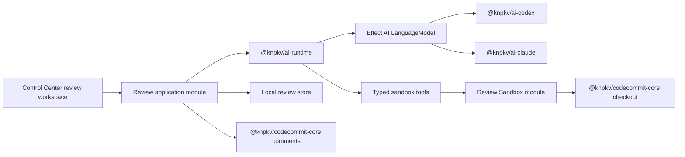

# Agentic pull-request review

## Outcome

Control Center replaces its pre-stable bounded pull-request analyzer with a local, full-project review agent. The agent explores an exact CodeCommit pull-request revision in an ephemeral sbx sandbox, runs commands and tests autonomously, and returns only structured Review Suggestions.

The agent never changes the branch or CodeCommit. The Local Operator may edit, revalidate, dismiss, or explicitly publish a suggestion as a CodeCommit comment.

## Product principles

- The diff remains the primary surface.
- Agent output is structured, evidence-backed, and editable.
- Full project access exists only inside an ephemeral sandbox.
- External mutations always require an explicit human preview and confirmation.
- Review history is durable; execution environments are disposable.
- Codex and Claude use the same provider-neutral agent runtime.
- This is a breaking replacement. Pre-stable review data and interfaces need no migration.

## User experience

### Review workspace

Opening a CodeCommit pull request uses one full-screen review workspace:

- A compact top summary shows the exact head, derived Review State, counts, coverage, and the large review action.
- A left rail lists changed files and filters by severity or suggestion state.
- The center renders the complete split or stacked diff through `@knpkv/rly/diff`, the pinned adapter over `@pierre/diffs`.
- Validated Review Suggestions render inline at their primary anchors.
- File-level and whole-change suggestions also appear in a compact overview above the diff.
- A collapsible right rail contains the durable Review Thread and live agent activity.
- Commands, files inspected, test progress, and limitations stream live. Speculative suggestions do not.

The Rly diff interface must be extended to render application-owned annotation cards without exposing Pierre types through Rly's public interface.

### Starting a run

`Review PR` opens a compact preflight popup showing:

- Exact head revision.
- Selected Review Agent Profile.
- Twenty-minute default Review Budget.
- Network disabled status and any explicit unauthenticated endpoint allowlist.

Advanced options remain collapsed. Reviews never start automatically after a push.

Explicit triggers are:

- Full review.
- Re-review of a new head.
- Revalidation of one suggestion.
- Targeted request from the Review Thread.

### Suggestion actions

A draft Review Suggestion supports:

- Edit directly or ask the agent to create a versioned edit.
- Revalidate its technical claim.
- Dismiss with a required reason.
- Mark resolved manually.
- Preview and publish to CodeCommit.

An agent edit preserves prior revisions. An edit that changes the technical claim invalidates the old evidence until revalidated.

Publishing opens a compact preview with the connected AWS identity, exact revision and anchor, final editable content, replacement diff, related locations, and one prominent `Post comment` action. Line and file anchors publish at their resolved line; whole-change anchors omit the CodeCommit location and publish as a general pull-request comment.

Published comments are snapshots. Before CodeCommit is called, Control Center atomically reserves the suggestion for the exact confirmed content digest. A competing edit is rejected, while an interrupted same-content retry remains compatible with the governed provider idempotency key. A successful provider receipt atomically completes that reservation and appends an immutable local lifecycle event; matching completion retries are no-ops. Durable review reads overlay that event as `published`, including after navigation, refresh, or restart. Later local edits do not synchronize automatically; updating a posted comment or posting a resolution reply requires another explicit preview.

Every posted comment has a compact provenance footer:

`Suggested by <agent> · reviewed at <head> · published by <operator>`

### Anchors

- Line suggestion: exact before/after diff position.
- File suggestion: first changed line in the file, falling back to line 1.
- Whole-change suggestion: general pull-request comment.

One root cause produces one suggestion with a primary anchor and navigable Related Locations. Publication creates one comment at the primary anchor and lists the related locations by default. The preview may explicitly split it into multiple comments.

## Structured result

Every Review Suggestion contains:

- Stable suggestion ID.
- Exact reviewed revision.
- Title.
- Primary Suggestion Anchor.
- Related Locations.
- Problem.
- Impact.
- Reproducible Review Evidence.
- Recommendation.
- Suggestion Severity.
- Confidence and confidence reason.
- Optional Suggested Replacement.
- Optional Prevention Proposal.

Suggested Replacement is a unified diff against the exact reviewed head plus a short explanation. It is inert and is never applied to the branch.

Prevention Proposal is allowed only for recurring, high-impact, mechanically enforceable defect classes. It may propose ast-grep, ESLint, a type check, a test, or repository agent instructions, but never changes the repository automatically.

Review Evidence identifies its kind and records enough bounded data to reproduce the observation, such as a code path, command and exit result, test failure, or deterministic analysis result.

The current presentation contract stores host-resolved line, file, and
whole-change anchors. File anchors record the first added line, or line 1 when a
file has no added hunk. Suggestion state is host-owned and filterable; models
cannot author it. Repeated occurrences are stored as Related Locations under
one root cause. Suggested Replacements carry the exact reviewed head, a unified
diff, and an explanation. Review Notes have independent host-derived identities
and are never accepted by the publication boundary. This is report schema v3;
pre-stable v2 reports are intentionally not migrated.

### Confidence

- High: directly reproduced or proven by deterministic analysis.
- Medium: strongly supported by code-path evidence without end-to-end execution.
- Low: plausible but unverified.

Low-confidence observations are non-publishable Review Notes. Confidence expresses evidence strength, not impact.

### Severity

- P1 · Blocker: unsafe to merge.
- P2 · Major: should be fixed before merge.
- P3 · Minor: valid defect with limited impact.
- P4 · Improvement: useful but non-blocking.

### Derived review state

The agent does not issue an overall verdict. Control Center derives:

- Changes Required: at least one open P1 or P2.
- Non-blocking Suggestions: only open P3 or P4.
- No Issues Found: a completed run with no suggestions.
- Unable to Conclude: incomplete exploration.

Validated suggestions from an incomplete run remain publishable, but the incomplete warning remains visible and the run can never yield No Issues Found.

## Suggestion lifecycle

A changed pull-request head makes prior suggestions stale and blocks their publication. Re-review creates a new immutable run and performs ID-based Suggestion Reconciliation:

- `still-present`: update anchor and evidence.
- `resolved`: close with validation evidence.
- `reopened`: restore a dismissed suggestion only with materially new evidence.
- `new`: create a new stable ID for a distinct root cause.

The agent may resolve suggestions without human confirmation. Resolution records the exact head, rationale, and evidence.

Dismissal requires one of:

- False positive.
- Not applicable.
- Accepted risk.
- Duplicate.
- Other.

Dismissed and resolved suggestions remain in history. They are never deleted or silently replaced.

Pre-existing defects and unverified concerns appear separately as non-publishable Review Notes.

## Runtime architecture

### `@knpkv/ai-runtime`

The existing provider-neutral runtime is deepened with a stateless structured tool-loop module. Its primary run interface accepts instructions, structured context, an Effect AI LanguageModel, typed tools, output schema, and budget. It streams typed activity and returns schema-validated output.

It owns:

- Iterative model/tool protocol.
- Bounded tool-result feedback.
- Cancellation and budget propagation.
- Output-schema validation.
- One schema-guided repair attempt.
- Typed activity events.

It does not own:

- Review concepts.
- Conversation persistence.
- sbx lifecycle policy.
- CodeCommit.
- Provider selection.

Codex and Claude are real adapters at the LanguageModel seam. The package does not depend on their native tool behavior.

Each tool result returned to the model is limited to 64 KiB with useful head and tail sections plus an artifact ID. Full output remains locally pageable and searchable under the retention policy.

### Review application module

Control Center owns:

- Review Threads and Review Context Snapshots.
- Review and suggestion state machines.
- Prompt and trusted instruction assembly.
- Agent-profile selection.
- Run persistence and recovery.
- Review State derivation.
- CodeCommit publication previews.
- UI projections.

A run receives a bounded Review Context Snapshot rather than the whole thread: current revision, suggestion summaries, relevant recent operator messages, and prior limitations. Full history is available through a lookup tool. Targeted revalidation receives the selected suggestion's complete history.

### CodeCommit checkout and sbx isolation

The CodeCommit integration retains profile discovery, authentication, exact checkout, and comment operations. Control Center owns the hardened Review Sandbox as an sbx-only policy.

A Review Checkout Broker:

1. Uses the connected CodeCommit profile on the host.
2. Fetches and verifies the exact base and head commit IDs.
3. Lets `sbx create shell --clone` copy the checkout into an isolated writable sandbox filesystem.
4. Removes authenticated remotes and credential configuration inside the sandbox before exposing any tools.
5. Deletes host staging data when the scoped run ends.

## Sandbox policy

The local `sbx` executable and optional template are selected outside the reviewed repository. A PR cannot change the runner evaluating itself.

The Review Sandbox is:

- Ephemeral and isolated in an sbx microVM.
- Writable inside its cloned sandbox filesystem.
- Free of host credentials and authority-bearing Git configuration.
- Network-disabled for the complete run.
- Autonomous inside its fixed policy: no command confirmations.
- Destroyed when the run ends.

The source broker checks out the immutable queued head and verifies it after
fetch. Control Center creates a named shell sandbox from that source with
`sbx create shell --clone`, immediately applies `sbx policy deny network`, then
executes a credential-free initialization command inside the sandbox. That
command removes Git remotes and credential helpers and verifies the exact head
again before any Review Sandbox tool can run.

Every contained command uses `sbx exec` with an explicit work directory and a
fixed minimal environment. Host environment inheritance and shell
interpretation of sbx control arguments are disabled.

Credentials are never injected. Tests requiring secrets or unavailable system capabilities are skipped and reported as limitations.

The AI provider process remains outside sbx. The provider-neutral tool loop
executes typed file read/list/search, arbitrary shell command, temporary patch,
diff, artifact-page, and artifact-search operations through the Review Sandbox
module. Command output is bounded before it reaches the model; larger accepted
output receives a session-local opaque artifact ID. A session retains at most
64 artifacts and 64 MiB, evicting the oldest artifacts first, while any one
pathological stream above 16 MiB is rejected. Provider CLIs never receive direct
host or sbx control access. File reads and listings preserve missing-path failures,
and temporary diffs include tracked, staged, unstaged, and non-ignored untracked
changes.

Executable repository instructions come only from the trusted base revision. Instruction changes in the PR are untrusted content under review.

## Execution and recovery

A Full review has a visible twenty-minute default budget, may finish early, and may receive one explicit extension. The agent chooses commands and test scope based on the change, trusted instructions, and remaining budget.

Control Center imposes no global concurrency limit. Independent runs may execute in parallel.

Run statuses are preparing, running, completed, cancelled, interrupted, failed, and timed out.

On startup, Control Center:

- Removes stale `cc-pr-review-*` sbx sandboxes.
- Recovers durable queued or lease-expired review jobs through the worker.
- Starts a fresh sandbox for a recovered attempt rather than simulating provider-session recovery.

Session acquisition and use are scoped. Cancellation, command or session
timeout, copy/start failure, callback failure, and normal completion all force
sbx sandbox removal. A command timeout fails the session before
returning its typed failure, and model-requested timeouts cannot exceed the
locally configured command cap. Startup reconciliation lists sbx sandboxes and
removes only names with the `cc-pr-review-` prefix.

Malformed tool arguments or final output receive one schema-guided repair attempt. A second invalid response ends as Unable to Conclude; missing data is never guessed.

## Local persistence and retention

- Thread messages, suggestions, notes, lifecycle events, and publication links: retained until manually deleted.
- Sanitized command timeline and evidence excerpts: retained for 30 days.
- Raw command output: retained for 7 days.
- Host staging checkout and sbx sandbox filesystem: deleted immediately after the run.

No migration or backward compatibility is required for the previous pre-stable review model.

## Telemetry

OpenTelemetry contains metadata only:

- Opaque run and pull-request IDs.
- Exact revision.
- Provider, model, and CLI version.
- Phase and command name.
- Duration and exit status.
- Suggestion counts.
- Error types.

Prompts, source, command output, model output, replacement patches, and credentials never enter traces.

## Acceptance gates

- Pure suggestion lifecycle and reconciliation state-machine tests.
- Scripted fake-model tests for `@knpkv/ai-runtime`: tool calls, schema repair, output bounds, cancellation, and timeout.
- sbx command-policy tests and an opt-in real sbx integration test when the CLI is available.
- CodeCommit adapter contract tests for exact-head checkout and comment publication.
- Durable publication replay for line, file, and whole-change suggestions.
- Browser flow: launch, live activity, inline suggestion, edit, revalidation, publication preview, staleness, and re-review.
- Opt-in real Codex smoke test using the locally authenticated CLI.

## Implementation sequence

1. Replace the review domain schema and state machines.
2. Deepen `@knpkv/ai-runtime` with the stateless tool-loop module and fake-model tests.
3. Reuse the exact CodeCommit checkout boundary.
4. Add the hardened sbx Review Sandbox policy and command/integration tests.
5. Implement Review Thread orchestration, persistence, retention, recovery, and metadata-only telemetry.
6. Extend `@knpkv/rly/diff` for application-rendered inline annotations.
7. Build the integrated PR review workspace and launch/publication popups.
8. Add CodeCommit comment create/update/reply operations and contract tests.
9. Add browser coverage and the opt-in real Codex smoke test.

## Decision records

- [0001 — Keep review suggestions draft until published](./adr/0001-keep-review-suggestions-draft-until-published.md)
- [0002 — Isolate review in an ephemeral writable sandbox](./adr/0002-isolate-agent-review-in-an-ephemeral-writable-sandbox.md)
- [0003 — Own review conversation history in Control Center](./adr/0003-own-review-conversation-history-in-control-center.md)
- [0004 — Trust review instructions only from the base revision](./adr/0004-trust-review-instructions-only-from-the-base-revision.md)
- [0005 — Integrate agent review into the diff workspace](./adr/0005-integrate-agent-review-into-the-diff-workspace.md)
- [0006 — Retain decisions longer than execution data](./adr/0006-retain-review-decisions-longer-than-execution-data.md)
- [0007 — Keep review content out of telemetry](./adr/0007-keep-review-content-out-of-telemetry.md)
- [0008 — Share CodeCommit mechanisms, not sandbox policy](./adr/0008-share-codecommit-mechanisms-not-sandbox-policy.md)
- [0009 — Use a provider-neutral agent tool loop](./adr/0009-use-a-provider-neutral-agent-tool-loop.md)
- [0010 — Test agent review through its public seams](./adr/0010-test-agent-review-through-its-public-seams.md)
- [0011 — Replace the pre-stable review model without migration](./adr/0011-replace-the-pre-stable-review-model-without-migration.md)
